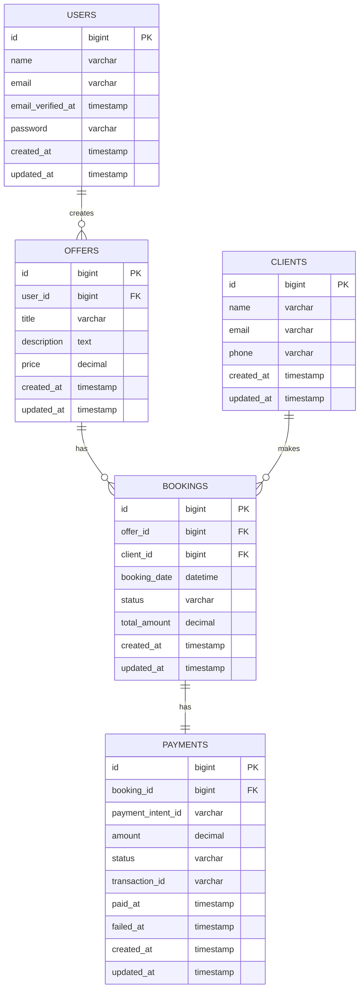

<<<<<<< HEAD
# ClinicBook - Healthcare Booking Platform

A modern healthcare booking platform that enables patients to discover healthcare services and book appointments with trusted providers. Built with Laravel backend and React frontend for a seamless user experience.

## 🏥 Project Overview

ClinicBook is a comprehensive healthcare appointment booking system that connects patients with healthcare providers. The platform features:

- **Public Service Discovery**: Browse available healthcare services without registration
- **Seamless Booking**: Simple appointment booking with client information collection
- **Secure Payments**: Integrated Stripe payment processing for appointment fees
- **Admin Dashboard**: Filament-powered admin panel for healthcare providers
- **Real-time Notifications**: Email notifications for new bookings 
- **Multi-tenant Support**: Each healthcare provider manages their own offers and bookings

## 🛠️ Technology Stack

### Backend
- **Laravel 12** - PHP web application framework
- **PHP 8.4** - Server-side programming language
- **Filament 3.3** - Admin panel and resource management
- **Stripe PHP SDK** - Payment processing integration
- **Laravel Sanctum** - API authentication
- **Pest** - Testing framework

### Frontend
- **React Router 7** - Full-stack React framework with SSR
- **TypeScript** - Type-safe JavaScript development
- **TailwindCSS 4** - Utility-first CSS framework
- **Stripe React Components** - Payment UI components
- **React Hook Form** - Form validation and management
- **Vitest** - Frontend testing framework

### Database
- **MySQL** - Primary database
- **SQLite** - Development and testing database
- **Laravel Migrations** - Database schema management

## 📊 Database Schema



### Entity Relationships

- **Users** (Healthcare Providers) create multiple **Offers** (Services)
- **Clients** (Patients) can make multiple **Bookings**
- Each **Booking** links an **Offer** with a **Client**
- Each **Booking** has one **Payment** record for transaction tracking

## 🔌 API Endpoints

### Public Endpoints

| Method | Endpoint | Description | Response |
|--------|----------|-------------|----------|
| `GET` | `/api/v1/offers` | List all available healthcare services | Array of offers with provider info |
| `GET` | `/api/v1/offers/{id}` | Get specific offer details | Single offer object |
| `POST` | `/api/v1/bookings` | Create new appointment booking | Booking confirmation |

### Payment Endpoints

| Method | Endpoint | Description | Response |
|--------|----------|-------------|----------|
| `POST` | `/api/v1/create-payment-intent/{booking}` | Create Stripe payment intent | Payment intent details |
| `POST` | `/api/v1/webhook/stripe` | Handle Stripe webhook events | Success/error status |

### Request/Response Examples

#### Create Booking
```json
POST /api/v1/bookings
{
  "offer_id": 1,
  "client_name": "John Doe",
  "client_email": "john@example.com",
  "client_phone": "+1234567890",
  "booking_date": "2025-06-10T14:00:00Z"
}
```

#### Response
```json
{
  "success": true,
  "data": {
    "id": 123,
    "offer_id": 1,
    "client_id": 45,
    "booking_date": "2025-06-10T14:00:00Z",
    "status": "pending",
    "total_amount": "150.00"
  },
  "message": "Booking created successfully"
}
```

## 🚀 Getting Started

### Prerequisites
- PHP 8.4+
- Composer
- Node.js 18+
- MySQL database
- Stripe account for payments

### Environment Variables
```env
# Backend (.env)
STRIPE_KEY=your_stripe_publishable_key
STRIPE_SECRET=your_stripe_secret_key
STRIPE_WEBHOOK_SECRET=your_webhook_secret

# Frontend
VITE_STRIPE_PUBLISHABLE_KEY=your_stripe_publishable_key
VITE_API_BASE_URL=http://localhost:8000/api/v1
```


## 📱 Features

- **Responsive Design**: Mobile-first approach with TailwindCSS
- **Payment Security**: PCI-compliant payment processing with Stripe
- **Admin Dashboard**: Comprehensive management interface with Filament
- **Email Notifications**
- **Multi-tenant Architecture**: Isolated data for each healthcare provider
=======
<p align="center"><a href="https://laravel.com" target="_blank"></a></p>

<p align="center">
<a href="https://github.com/laravel/framework/actions"></a>
<a href="https://packagist.org/packages/laravel/framework"></a>
<a href="https://packagist.org/packages/laravel/framework"></a>
<a href="https://packagist.org/packages/laravel/framework"></a>
</p>

## About Laravel

Laravel is a web application framework with expressive, elegant syntax. We believe development must be an enjoyable and creative experience to be truly fulfilling. Laravel takes the pain out of development by easing common tasks used in many web projects, such as:

- [Simple, fast routing engine](https://laravel.com/docs/routing).
- [Powerful dependency injection container](https://laravel.com/docs/container).
- Multiple back-ends for [session](https://laravel.com/docs/session) and [cache](https://laravel.com/docs/cache) storage.
- Expressive, intuitive [database ORM](https://laravel.com/docs/eloquent).
- Database agnostic [schema migrations](https://laravel.com/docs/migrations).
- [Robust background job processing](https://laravel.com/docs/queues).
- [Real-time event broadcasting](https://laravel.com/docs/broadcasting).

Laravel is accessible, powerful, and provides tools required for large, robust applications.

## Learning Laravel

Laravel has the most extensive and thorough [documentation](https://laravel.com/docs) and video tutorial library of all modern web application frameworks, making it a breeze to get started with the framework.

You may also try the [Laravel Bootcamp](https://bootcamp.laravel.com), where you will be guided through building a modern Laravel application from scratch.

If you don't feel like reading, [Laracasts](https://laracasts.com) can help. Laracasts contains thousands of video tutorials on a range of topics including Laravel, modern PHP, unit testing, and JavaScript. Boost your skills by digging into our comprehensive video library.

## Laravel Sponsors

We would like to extend our thanks to the following sponsors for funding Laravel development. If you are interested in becoming a sponsor, please visit the [Laravel Partners program](https://partners.laravel.com).

### Premium Partners

- **[Vehikl](https://vehikl.com)**
- **[Tighten Co.](https://tighten.co)**
- **[Kirschbaum Development Group](https://kirschbaumdevelopment.com)**
- **[64 Robots](https://64robots.com)**
- **[Curotec](https://www.curotec.com/services/technologies/laravel)**
- **[DevSquad](https://devsquad.com/hire-laravel-developers)**
- **[Redberry](https://redberry.international/laravel-development)**
- **[Active Logic](https://activelogic.com)**

## Contributing

Thank you for considering contributing to the Laravel framework! The contribution guide can be found in the [Laravel documentation](https://laravel.com/docs/contributions).

## Code of Conduct

In order to ensure that the Laravel community is welcoming to all, please review and abide by the [Code of Conduct](https://laravel.com/docs/contributions#code-of-conduct).

## Security Vulnerabilities

If you discover a security vulnerability within Laravel, please send an e-mail to Taylor Otwell via [taylor@laravel.com](mailto:taylor@laravel.com). All security vulnerabilities will be promptly addressed.

## License

The Laravel framework is open-sourced software licensed under the [MIT license](https://opensource.org/licenses/MIT).
>>>>>>> 15aa86952bd508b633383d99fa5138aee0d9abb0
