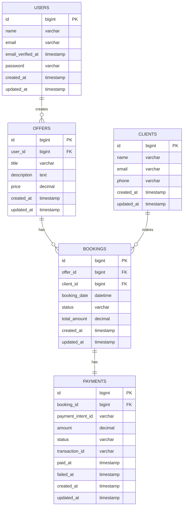

# ClinicBook - Healthcare Booking Platform

A modern healthcare booking platform that enables patients to discover healthcare services and book appointments with trusted providers. Built with Laravel backend and React frontend for a seamless user experience.

## 🏥 Project Overview

ClinicBook is a comprehensive healthcare appointment booking system that connects patients with healthcare providers. The platform features:

- **Public Service Discovery**: Browse available healthcare services without registration
- **Seamless Booking**: Simple appointment booking with client information collection
- **Secure Payments**: Integrated Stripe payment processing for appointment fees
- **Admin Dashboard**: Filament-powered admin panel for healthcare providers
- **Real-time Notifications**: Email notifications for booking confirmations
- **Multi-tenant Support**: Each healthcare provider manages their own offers and bookings

## 🛠️ Technology Stack

### Backend
- **Laravel 12** - PHP web application framework
- **PHP 8.4** - Server-side programming language
- **Filament 3.3** - Admin panel and resource management
- **Stripe PHP SDK** - Payment processing integration
- **Laravel Sanctum** - API authentication
- **Pest** - Testing framework

### Frontend
- **React Router 7** - Full-stack React framework with SSR
- **TypeScript** - Type-safe JavaScript development
- **TailwindCSS 4** - Utility-first CSS framework
- **Stripe React Components** - Payment UI components
- **React Hook Form** - Form validation and management
- **Vitest** - Frontend testing framework

### Database
- **MySQL** - Primary database
- **SQLite** - Development and testing database
- **Laravel Migrations** - Database schema management

## 📊 Database Schema



### Entity Relationships

- **Users** (Healthcare Providers) create multiple **Offers** (Services)
- **Clients** (Patients) can make multiple **Bookings**
- Each **Booking** links an **Offer** with a **Client**
- Each **Booking** has one **Payment** record for transaction tracking

## 🔌 API Endpoints

### Public Endpoints

| Method | Endpoint | Description | Response |
|--------|----------|-------------|----------|
| `GET` | `/api/v1/offers` | List all available healthcare services | Array of offers with provider info |
| `GET` | `/api/v1/offers/{id}` | Get specific offer details | Single offer object |
| `POST` | `/api/v1/bookings` | Create new appointment booking | Booking confirmation |

### Payment Endpoints

| Method | Endpoint | Description | Response |
|--------|----------|-------------|----------|
| `POST` | `/api/v1/create-payment-intent/{booking}` | Create Stripe payment intent | Payment intent details |
| `POST` | `/api/v1/webhook/stripe` | Handle Stripe webhook events | Success/error status |

### Request/Response Examples

#### Create Booking
```json
POST /api/v1/bookings
{
  "offer_id": 1,
  "client_name": "John Doe",
  "client_email": "john@example.com",
  "client_phone": "+1234567890",
  "booking_date": "2025-06-10T14:00:00Z"
}
```

#### Response
```json
{
  "success": true,
  "data": {
    "id": 123,
    "offer_id": 1,
    "client_id": 45,
    "booking_date": "2025-06-10T14:00:00Z",
    "status": "pending",
    "total_amount": "150.00"
  },
  "message": "Booking created successfully"
}
```

## 🚀 Getting Started

### Prerequisites
- PHP 8.4+
- Composer
- Node.js 18+
- MySQL database
- Stripe account for payments

### Backend Setup
```bash
cd backend
composer install
cp .env.example .env
php artisan key:generate
php artisan migrate
php artisan serve
```

### Frontend Setup
```bash
cd frontend
npm install
npm run dev
```

### Environment Variables
```env
# Backend (.env)
STRIPE_KEY=your_stripe_publishable_key
STRIPE_SECRET=your_stripe_secret_key
STRIPE_WEBHOOK_SECRET=your_webhook_secret

# Frontend
VITE_STRIPE_PUBLISHABLE_KEY=your_stripe_publishable_key
VITE_API_BASE_URL=http://localhost:8000/api/v1
```

## 🧪 Testing

### Backend Tests
```bash
cd backend
php artisan test
```

### Frontend Tests
```bash
cd frontend
npm run test
```

## 📱 Features

- **Responsive Design**: Mobile-first approach with TailwindCSS
- **Server-Side Rendering**: Fast initial page loads with React Router 7
- **Payment Security**: PCI-compliant payment processing with Stripe
- **Admin Dashboard**: Comprehensive management interface with Filament
- **Email Notifications**: Automated booking confirmations
- **Multi-tenant Architecture**: Isolated data for each healthcare provider

## 🤝 Contributing

1. Fork the repository
2. Create a feature branch (`git checkout -b feature/amazing-feature`)
3. Commit your changes (`git commit -m 'Add amazing feature'`)
4. Push to the branch (`git push origin feature/amazing-feature`)
5. Open a Pull Request

## 📄 License

This project is licensed under the MIT License - see the [LICENSE](LICENSE) file for details.

## 🔗 Links

- **Repository**: [https://github.com/Elmoatassimm/Shafaq.git](https://github.com/Elmoatassimm/Shafaq.git)
- **Laravel Documentation**: [https://laravel.com/docs](https://laravel.com/docs)
- **React Router Documentation**: [https://reactrouter.com](https://reactrouter.com)
- **Stripe Documentation**: [https://stripe.com/docs](https://stripe.com/docs)
